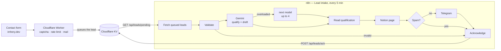

# lead-assistant

An n8n automation that reads every message sent through the contact form of
[imhery.dev](https://imhery.dev), qualifies it with an LLM, drafts a reply in the
visitor's language, files the lead in a Notion CRM and pings me on Telegram.

Runs on **n8n Community Edition, self-hosted** — free, no n8n Cloud subscription — and
on free tiers only: Gemini API, Notion API, Telegram Bot API.



## What it does with one lead

1. The portfolio's Worker checks the form (honeypot, time trap, rate limit, Turnstile),
   sends me the mail as it always has, **then** puts the lead in a queue (Cloudflare
   KV). Nothing calls n8n: it comes to collect, every 5 minutes. So it can run on a PC
   that is not always on — leads sent meanwhile wait in the queue, and nothing on the
   PC is reachable from the internet. See [the queue contract](docs/queue.md).
2. **Validate** keeps only the expected fields, caps their length, and sets aside a
   lead missing a required one.
3. **Gemini** reads it against [a prompt](prompts/qualify.md) and answers JSON held to
   [a schema](prompts/qualify.schema.json): language, one-line summary, project type,
   budget realism, urgency, a 0–100 score with its reasons, what to ask before quoting,
   spam or not, and a reply draft in the visitor's language. Free Gemini models answer
   503 "high demand" for minutes at a time, so `GEMINI_MODELS` lists several: when one
   fails the next gets the lead, up to four. If none answers, the lead is still filed,
   marked "qualification incomplète". The Notion page and the Telegram message say which
   model did the work.
4. **Notion** gets one page per lead in a [CRM database](docs/notion.md): the fields to
   sort on as properties, the message and the draft in the page.
5. **Telegram** sends me the essentials and the link to that page. Spam is filed
   without a message.
6. **Acknowledge** removes the lead from the queue — only once Notion has it. If Notion
   is down, that lead stays queued for the next run; the others carry on.

What the notification looks like, for [`samples/lead-en.json`](samples/lead-en.json)
(illustrative — the summary and questions are the model's):

```
🔥 Nouveau prospect — 86/100
▰▰▰▰▰▰▰▰▰▱

Daniel Moore · Northwind Logistics
Northwind veut automatiser la saisie de 300 bons de livraison par jour vers son ERP.

Type : IA & automatisation
Budget : $6,000 – $12,000 (Réaliste)
Urgence : Normale — échéance 2027-01-31
Langue : en · Source : LinkedIn

À demander
• Quel ERP, et son API est-elle documentée ?
• Quel taux d'erreur est acceptable avant vérification humaine ?

Ouvrir la fiche et le brouillon dans Notion
```

## Run it

Requirements: Docker. Nothing else is installed on the host.

```bash
cp .env.example .env          # fill in N8N_ENCRYPTION_KEY, NOTION_DATABASE_ID, TELEGRAM_CHAT_ID
docker compose up -d          # n8n on http://localhost:5678, for this machine only
```

Before n8n, check the three services — keys, bot, database — in one command. It asks
for the three secrets with the input hidden (or reads `GEMINI_API_KEY`,
`TELEGRAM_BOT_TOKEN`, `NOTION_TOKEN` from the environment), never prints or saves them,
sends you one Telegram test message, compares the Notion database to what the workflow
writes, and runs one real qualification of `samples/lead-en.json` so you see the prompt
at work:

```bash
npm run check                 # Node 24, no dependency
npm run check -- --models     # which Gemini models your key can use → a GEMINI_MODELS line
```

Open n8n, create the owner account, then:

### 1. Credentials

Created once in **Credentials → Add credential**. They are encrypted with
`N8N_ENCRYPTION_KEY` and never written to a file of this repository.

| Name (exactly) | Type | Values |
|---|---|---|
| `Leads API token` | Header Auth | Name `Authorization`, value `Bearer <token>` — a long random string (`openssl rand -hex 32`); the same token is the Worker's `LEADS_API_TOKEN` secret |
| `Gemini API key` | Header Auth | Name `x-goog-api-key`, value: a key from [Google AI Studio](https://aistudio.google.com/apikey) (free tier) |
| `Notion integration token` | Header Auth | Name `Authorization`, value `Bearer <token>` — see [docs/notion.md](docs/notion.md) |
| `Telegram bot` | Telegram API | Token from [@BotFather](https://t.me/BotFather); leave the base URL as is |

### 2. Workflow

**Workflows → Import from file →** [`workflows/lead-intake.json`](workflows/lead-intake.json),
select the credentials on the nodes that ask for them, then **Publish**. Or from the CLI:

```bash
docker compose exec n8n n8n import:workflow --input=/workflows/lead-intake.json
docker compose exec n8n n8n publish:workflow --id=leadIntake000001
docker compose restart n8n
```

### 3. Try it

Open the workflow and click **Execute workflow** on the **Run now** node: it empties the
queue at once instead of waiting for the next 5-minute tick. Each run shows in
**Executions**, one item per lead.

### 4. The portfolio side

The Worker needs two routes and a KV namespace — the contract is in
[docs/queue.md](docs/queue.md) — plus the `LEADS_API_TOKEN` secret, the same value as
the `Leads API token` credential. That code lives in the portfolio's own repository.

## Repository

```
prompts/        the qualification prompt and its JSON schema
src/            the logic of each Code node, as plain tested JavaScript
scripts/        build.mjs — assembles src/ and prompts/ into the n8n export
workflows/      lead-intake.json — generated, the file you import
samples/        requests to replay
docs/           the queue contract, the Notion database
test/           unit tests; e2e/ runs the real n8n against fake APIs
```

The workflow is **built, not hand-edited**: an n8n export keeps each Code node and the
prompt as escaped strings, which nobody can review or test. Here the code lives in
`src/`, the prompt in `prompts/`, and `npm run build` writes the export — ids derive
from node names, so an unchanged workflow rebuilds byte for byte.

## Tests

```bash
npm test                              # unit tests, no dependency
N8N_BIN=$(which n8n) npm run e2e      # the real n8n, a fake queue and fake Gemini / Notion / Telegram
```

The end-to-end run imports the export into a throwaway n8n and runs it with `n8n
execute` against a local server playing the Worker's queue, Gemini, Notion and
Telegram. Four leads at once — qualified, spam, invalid, and one whose Gemini call fails
twice — all filed or dropped as they should and acknowledged; Notion down leaves the
lead queued without crashing the run; Notion back lets it through; an empty queue costs
one request. Nothing leaves the machine.

## Security

- Nothing reaches n8n from outside: it only makes outgoing requests, and its editor
  listens on `127.0.0.1`. The queue answers only to the bearer token.
- Only the contract's fields reach the prompt, trimmed and capped; the prompt tells the
  model the enquiry is data, never instructions; the answer is parsed against the
  schema and every field falls back to a safe value.
- Secrets are n8n credentials, encrypted at rest. `.env` holds settings only and is
  gitignored; a test fails if anything shaped like an API key lands in the export.

## License

MIT — see [LICENSE](LICENSE).
