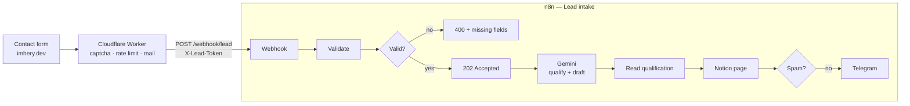

# lead-assistant

An n8n automation that reads every message sent through the contact form of
[imhery.dev](https://imhery.dev), qualifies it with an LLM, drafts a reply in the
visitor's language, files the lead in a Notion CRM and pings me on Telegram.

Runs on **n8n Community Edition, self-hosted** — free, no n8n Cloud subscription — and
on free tiers only: Gemini API, Notion API, Telegram Bot API.



## What it does with one lead

1. The portfolio's Worker checks the form (honeypot, time trap, rate limit, Turnstile),
   sends me the mail as it always has, **then** forwards the form here. If n8n is down,
   nothing is lost: the mail already left.
2. **Validate** keeps only the fields of the [contract](docs/payload.md), caps their
   length and answers `400` with the missing ones. A valid lead gets `202` at once — the
   Worker never waits on the LLM.
3. **Gemini** reads it against [a prompt](prompts/qualify.md) and answers JSON held to
   [a schema](prompts/qualify.schema.json): language, one-line summary, project type,
   budget realism, urgency, a 0–100 score with its reasons, what to ask before quoting,
   spam or not, and a reply draft in the visitor's language.
4. **Notion** gets one page per lead in a [CRM database](docs/notion.md): the fields to
   sort on as properties, the message and the draft in the page.
5. **Telegram** sends me the essentials and the link to that page. Spam is filed and
   stops there.

What the notification looks like, for [`samples/lead-en.json`](samples/lead-en.json)
(illustrative — the summary and questions are the model's):

```
🔥 Nouveau prospect — 86/100
▰▰▰▰▰▰▰▰▰▱

Daniel Moore · Northwind Logistics
Northwind veut automatiser la saisie de 300 bons de livraison par jour vers son ERP.

Type : IA & automatisation
Budget : $6,000 – $12,000 (Réaliste)
Urgence : Normale — échéance 2027-01-31
Langue : en · Source : LinkedIn

À demander
• Quel ERP, et son API est-elle documentée ?
• Quel taux d'erreur est acceptable avant vérification humaine ?

Ouvrir la fiche et le brouillon dans Notion
```

## Run it

Requirements: Docker. Nothing else is installed on the host.

```bash
cp .env.example .env          # fill in N8N_ENCRYPTION_KEY, NOTION_DATABASE_ID, TELEGRAM_CHAT_ID
docker compose up -d          # n8n on http://localhost:5678
```

Open n8n, create the owner account, then:

### 1. Credentials

Created once in **Credentials → Add credential**. They are encrypted with
`N8N_ENCRYPTION_KEY` and never written to a file of this repository.

| Name (exactly) | Type | Values |
|---|---|---|
| `Lead webhook token` | Header Auth | Name `X-Lead-Token`, value: a long random string (`openssl rand -hex 32`) — the same one goes to the Worker |
| `Gemini API key` | Header Auth | Name `x-goog-api-key`, value: a key from [Google AI Studio](https://aistudio.google.com/apikey) (free tier) |
| `Notion integration token` | Header Auth | Name `Authorization`, value `Bearer <token>` — see [docs/notion.md](docs/notion.md) |
| `Telegram bot` | Telegram API | Token from [@BotFather](https://t.me/BotFather); leave the base URL as is |

### 2. Workflow

**Workflows → Import from file →** [`workflows/lead-intake.json`](workflows/lead-intake.json),
select the credentials on the nodes that ask for them, then **Publish**. Or from the CLI:

```bash
docker compose exec n8n n8n import:workflow --input=/workflows/lead-intake.json
docker compose exec n8n n8n publish:workflow --id=leadIntake000001
docker compose restart n8n
```

### 3. Try it

```bash
curl -i -X POST http://localhost:5678/webhook/lead \
  -H "Content-Type: application/json" -H "X-Lead-Token: <your token>" \
  --data @samples/lead-en.json
```

`202`, then the Notion page and the Telegram message a few seconds later.

### 4. Open it to the Worker

`docker compose --profile tunnel up -d` starts a Cloudflare Tunnel (free) with the token
in `.env`; route its public hostname to `http://n8n:5678` and set `N8N_PUBLIC_URL`. The
Worker then posts to `https://<hostname>/webhook/lead`. No port is opened on the machine.

## Repository

```
prompts/        the qualification prompt and its JSON schema
src/            the logic of each Code node, as plain tested JavaScript
scripts/        build.mjs — assembles src/ and prompts/ into the n8n export
workflows/      lead-intake.json — generated, the file you import
samples/        requests to replay
docs/           the webhook contract, the Notion database
test/           unit tests; e2e/ runs the real n8n against fake APIs
```

The workflow is **built, not hand-edited**: an n8n export keeps each Code node and the
prompt as escaped strings, which nobody can review or test. Here the code lives in
`src/`, the prompt in `prompts/`, and `npm run build` writes the export — ids derive
from node names, so an unchanged workflow rebuilds byte for byte.

## Tests

```bash
npm test                              # unit tests, no dependency
N8N_BIN=$(which n8n) npm run e2e      # the real n8n, fake Gemini / Notion / Telegram
```

The end-to-end run imports the export into a throwaway n8n, publishes it and checks:
`403` without the token, `400` with the missing fields and no API called, `202` then
Gemini → Notion → Telegram with the right headers and bodies, and spam filed without a
notification. Nothing leaves the machine.

## Security

- The webhook refuses any request without the shared token, before any node runs.
- Only the contract's fields reach the prompt, trimmed and capped; the prompt tells the
  model the enquiry is data, never instructions; the answer is parsed against the
  schema and every field falls back to a safe value.
- Secrets are n8n credentials, encrypted at rest. `.env` holds settings only and is
  gitignored; a test fails if anything shaped like an API key lands in the export.
- n8n listens on `127.0.0.1` only; the outside world comes in through the tunnel.

## License

MIT — see [LICENSE](LICENSE).
